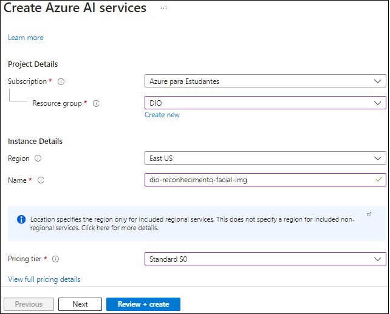
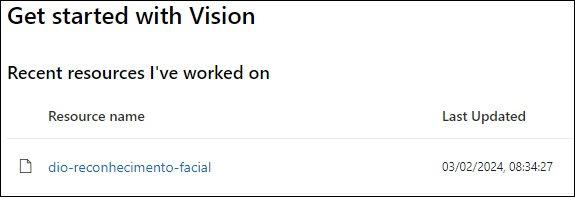
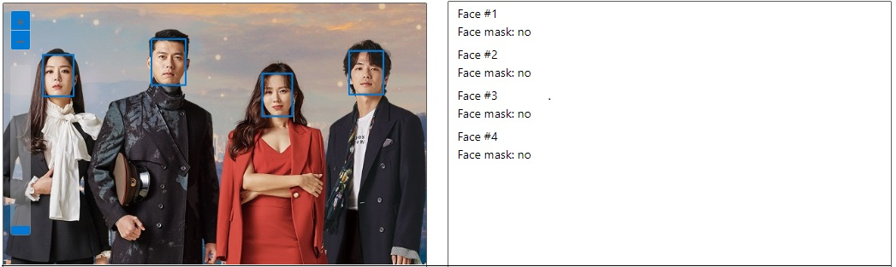
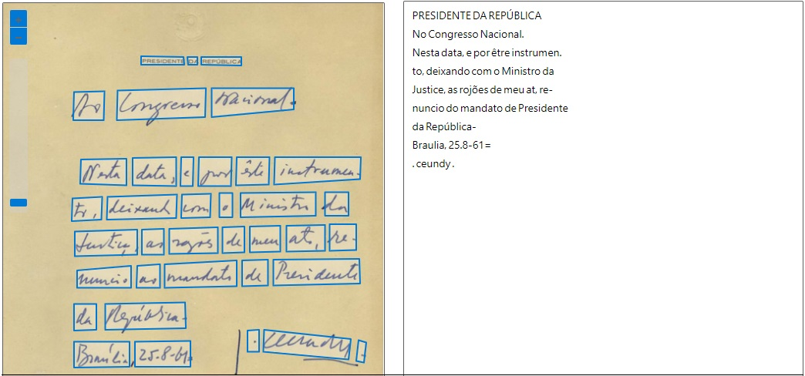
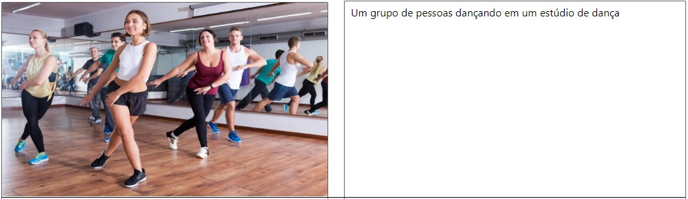

    
        
        <h1 style="margin: 0; text-shadow: 2px 2px 3px #888;">Microsoft Azure AI Fundamentals</h1>
    

 

    <h2 style="margin: 0; text-shadow: 2px 2px 3px #888; font-family: 'Helvetica', sans-serif; text-decoration: none;">
Reconhecimento Facial e transformação de imagens em Dados no Azure ML</h2>

    

               <h4 style="margin: 0; text-shadow: 2px 2px 3px #888; font-family: 'Raleway', sans-serif;">I ❤️ Front-End Development!</h4>
    

<h3>Encontre-me :handshake: </h3> 

    
    
    
</a>
    
    
    

 

---

### Menu
- [Introdução :pushpin:](#introdução-pushpin)
- [Configuração do Azure :gear:](#configuração-do-azure-gear)
- [Desafio 1: Detectar rostos em uma imagem :performing\_arts:](#desafio-1-detectar-rostos-em-uma-imagem-performing_arts)
- [Experimente com Suas Próprias Imagens :framed\_picture:](#experimente-com-suas-próprias-imagens-framed_picture)
- [Desafio 2: Extrair Texto de Imagem :dart:](#desafio-2-extrair-texto-de-imagem-dart)
- [Desafio 3: Adicione legendas às imagens :computer:](#desafio-3-adicione-legendas-às-imagens-computer)
- [Licença :traffic\_light:](#licença-traffic_light)
- [Agradecimentos :tada:](#agradecimentos-tada)

## Introdução :pushpin:

Bem-vindo ao bootcamp: Microsoft Azure AI Fundamentals. A líder no mercado em nuvem se juntou à DIO para preparar profissionais para a certificação AI-900, o futuro da IA com cloud!

Ao final desse projeto os alunos irão adquirir domínio em conceitos como visão computacional, classificação inteligente de imagem e inteligência de documentos com IA enquanto se familiariza com as tecnologias da Microsoft Azure e se prepara para realizar o exame de certificação AI-900 com sucesso.

Com conteúdo completamente inédito, você vai se aprofundar nos principais conceitos das ferramentas do Azure para ganhar velocidade e performance em suas aplicações com inteligência artificial, e concorrer a um dos 700 vouchers para tirar a sua certificação de forma completamente gratuita.

## Configuração do Azure :gear:

1. Crie um recurso de serviços de IA do Azure
   
- Acesse o Portal Azure e faça login com sua conta Microsoft associada à assinatura do Azure.

Clique em ＋Criar um recurso e pesquise por serviços de IA do Azure.

- Escolha criar um plano de serviços de IA do Azure com as configurações:
  
    - Assinatura: Sua assinatura do Azure.
    - Grupo de Recursos: Selecione ou crie um grupo de recursos exclusivo.
    - Região: Leste dos EUA.
    - Nome: Insira um nome exclusivo.
    - Nível de Preços: Padrão S0.
    - Marque a caixa de confirmação.
    - Selecione Revisar + criar e aguarde a conclusão da implantação.
  

1. Conecte seu recurso ao Vision Studio
Acesse Vision Studio.

- Selecione Visualizar todos os recursos em Introdução ao Vision.

- Passe o cursor sobre o recurso criado, marque a caixa e selecione Selecionar como recurso padrão.

## Desafio 1: Detectar rostos em uma imagem :performing_arts:

**Acesse Vision Studio**

- Selecione a guia Face e escolha Detectar rostos em uma imagem na seção Experimente.

- Reconheça a política de uso de recursos marcando a caixa.

**Teste com Imagens de Amostra**

- Selecione cada imagem de amostra e observe os dados de detecção facial retornados.
  
## Experimente com Suas Próprias Imagens :framed_picture:

- Faça upload da imagem desejada e revise os detalhes de detecção de rosto.

-Faça o mesmo com uma imagem de mais pessoas.

Ao concluir este exercício, você terá explorado com sucesso como os serviços de IA do Azure, em particular o Azure AI Face, podem detectar rostos em imagens. Sinta-se à vontade para experimentar com suas próprias imagens para uma experiência mais abrangente.

...

## Desafio 2: Extrair Texto de Imagem :dart:

Com este recurso, você utilizará o serviço Azure AI para explorar as capacidades de Reconhecimento Óptico de Caracteres (OCR) do Azure AI Vision. O Vision Studio será a ferramenta principal para experimentar a extração de texto de imagens, sem a necessidade de programação.

**Conecte seu recurso ao Vision Studio**

- Acesse o Vision Studio.

- Selecione o recurso criado como padrão.

- Feche a página de configurações.

**Extração de Texto no Vision Studio**

- Navegue até Vision Studio.

- Selecione a guia "Reconhecimento Óptico de Caracteres" e depois o bloco "Extrair texto de imagens".

- Reconheça a política de uso de recursos.
Baixe o arquivo ocr-images.zip e abra a pasta.

- Selecione "Procurar um arquivo" e carregue "advert.jpg". Revise os resultados que incluem a estrutura hierárquica do texto e caixas delimitadoras.

- Experimente com outras imagens como "carta.jpg", "note.jpg" e "recibo.jpg", revisando os resultados para cada uma.

Ao concluir este procedimento, você terá explorado com sucesso as capacidades de OCR do Azure AI Vision usando o Vision Studio, sem a necessidade de codificação. Sinta-se à vontade para experimentar com suas próprias imagens, expandindo ainda mais seus conhecimentos.

...

## Desafio 3: Adicione legendas às imagens :computer:

Este guia fornece instruções passo a passo sobre como utilizar o Azure AI Vision Studio para analisar imagens, explorando várias capacidades, como geração de legendas, extração de tags comuns e detecção de objetos.

**Conecte seu recurso ao Vision Studio**

- Acesse Vision Studio.
- Selecione Visualizar todos os recursos em Introdução ao Vision.
- Passe o cursor sobre o recurso criado, marque a caixa e selecione
  
**Selecionar como recurso padrão.**

- Geração de Legendas
- Acesse Vision Studio.
- Selecione a guia Análise de imagem e escolha Adicionar legendas às imagens.
- Carregue a imagem e observe a legenda gerada no painel de Atributos detectados.

Ao seguir essas etapas, você terá explorado as capacidades do Azure AI Vision para análise de imagens. Sinta-se à vontade para experimentar com outras imagens e ajustar configurações para uma experiência mais aprofundada.

...

---

## Licença :traffic_light:
Este projeto está licenciado sob a Licença consulte o arquivo 
 [MIT](https://opensource.org/licenses/MIT).

## Agradecimentos :tada:

_**Digital Innovation One**_ 

Agradeço à Digital Innovation One por proporcionar recursos educacionais valiosos que contribuíram para o desenvolvimento dos meus projetos.

 

_**Azure**_

Expresso minha gratidão à equipe do Microsoft Azure por oferecer uma plataforma robusta e escalável para hospedar e gerenciar aplicativos em nuvem. A eficiência e confiabilidade do Azure são fundamentais para o sucesso de muitos projetos.

_**VS Code**_

Agradeço à equipe do Visual Studio Code pelo incrível editor que facilita o desenvolvimento deste projeto.

_**Microsoft**_

Agradeço à equipe da Microsoft por suas contribuições inovadoras para o mundo da tecnologia. Sua dedicação ao desenvolvimento de software e serviços tem impactado positivamente a comunidade global de desenvolvedores.

_**GitHub**_ 

Agradeço à equipe do GitHub por fornecer uma plataforma de desenvolvimento colaborativo que facilita o compartilhamento de projetos.

Copyright © 2024 / RenatoMor

